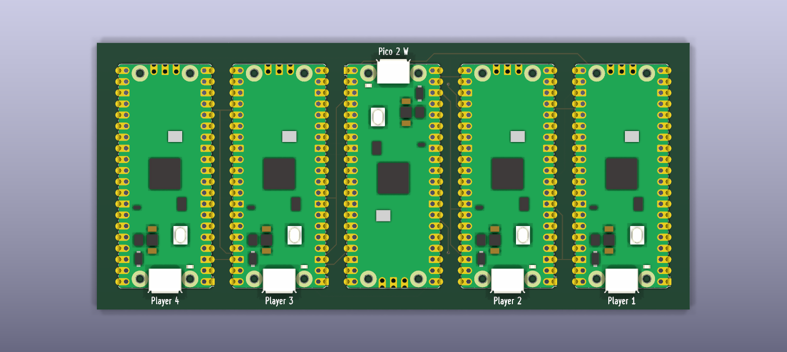
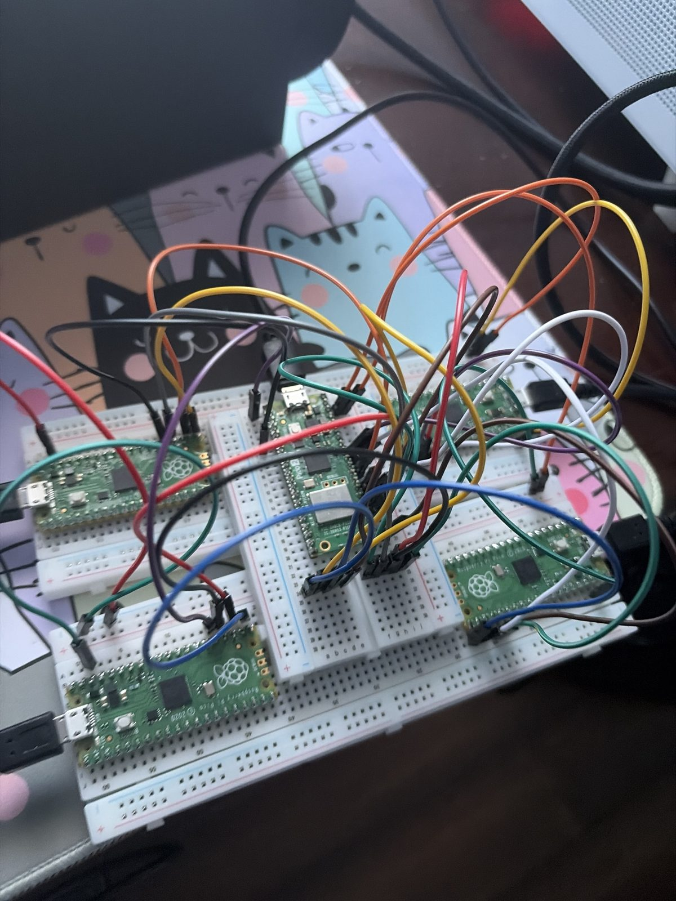

# Ounce

Play your Nintendo Switch from anywhere. Four Picos each appear to the Switch as
a real Switch Pro Controller, a fifth drives them over SPI, and a Windows client
turns your keyboard and USB pads into those four players while showing the
Switch's video in the same window.

```
keyboard / pads -> Windows client -> USB serial -> Pico 2 W master
                                                        |  SPI
                                          +------+------+------+------+
                                        Pico   Pico   Pico   Pico   -> Switch USB
                                       player1 player2 player3 player4
```



> **The artwork is AI-generated.** The banner, logo and app icon all came out of
> an image model — this is a hobby project and I could not afford to pay an
> artist for it. Everything in [`Ounce-Client/Graphics/`](Ounce-Client/Graphics/)
> is that; the photos of the board and the wiring are real. Artists welcome —
> open an issue.

## Parts

| Qty | Part | Purpose |
| --- | --- | --- |
| 1 | **Raspberry Pi Pico 2 W** (RP2350) | Master |
| 4 | **Raspberry Pi Pico 1** (RP2040) | Servants — one per player |
| 5 | Micro-USB cables | 4 for servants -> Switch (powered hub into the dock), 1 for master -> PC (power + serial) |
| 1 | **Elgato capture card** (4K S or similar) | Switch video in the client window |
| 1 | **Ounce PCB** or breadboard + jumpers | SPI bus and common ground |

Capture card is optional — run with `--no-preview` for input only.

## Layout

```
bin/
├── firmware/      OunceMaster.uf2, OunceServant.uf2   <-- flash these
├── client/        OunceClient/ - the app, no Python needed
└── pcb/           Ounce-PCB-fab.zip - gerbers + drill, ready to order
Ounce-Client/      Windows client: test_bridge.py, wiring_test.py, build_exe.bat
└── Graphics/      AI-generated logo, icon and banner - all of it, see its README
Ounce-Hardware/    master-firmware/, servant-firmware/, pcb/, pico-sdk/
```

## Wiring

SCK and MOSI are **shared** by all four servants. CS and MISO are **one per
servant** — an RP2040 slave does not release MISO when deselected, so four on
one wire would fight.

**Master (Pico 2 W)**

| Signal | GPIO | Pin | To |
| --- | --- | --- | --- |
| SCK | GP18 | 24 | SCK on all servants |
| MOSI | GP19 | 25 | MOSI (GP16) on all servants |
| CS 0–3 | GP21, GP22, GP26, GP27 | 27, 29, 31, 32 | CS on servant 0, 1, 2, 3 |
| MISO 0–3 | GP0, GP4, GP16, GP20 | 1, 6, 21, 26 | MISO from servant 0, 1, 2, 3 |
| GND | GND | 38 | GND (pin 38) on every servant |

**Each servant (Pico 1)** — identical for all four:

| Signal | GPIO | Pin | To |
| --- | --- | --- | --- |
| MOSI in | GP16 | 21 | master GP19 |
| CS | GP17 | 22 | that servant's own CS pin |
| SCK | GP18 | 24 | master GP18 |
| MISO out | GP19 | 25 | that servant's own MISO pin |
| GND | GND | 38 | master GND (pin 38) |

**Every board must share a ground with the master** — without it you get
intermittent garbage rather than a clean failure. Bus is 4 MHz, SPI mode 1.
Servants are numbered purely by which CS pin they are wired to, so any Pico
works in any slot.

Breadboard and jumpers work fine — this is the build the firmware was developed
against, and it holds 94–100% packet delivery at 4 MHz:



The PCB is the same eleven nets, tidier.

Verify before going further:

```bash
python Ounce-Client/wiring_test.py            # PASS/FAIL per slot
python Ounce-Client/wiring_test.py --identify # drive one slot at a time
python Ounce-Client/wiring_test.py --map      # slot -> board -> Windows USB device
```

SPI slot order and USB enumeration order are unrelated — slot 2 is just "the
board on CS GP26" and may appear third or fourth in Windows.

## Flashing

Prebuilt images are in `bin/` — no build needed.

| Board | Hold BOOTSEL, plug in, drive appears | Drag on |
| --- | --- | --- |
| Servants (×4) | `RPI-RP2` | `bin/firmware/OunceServant.uf2` |
| Master | `RP2350` | `bin/firmware/OunceMaster.uf2` |

All four servants get the **same** file; each learns its player number from its
CS pin.

The servants ask the Switch to poll them every **1 ms**, not the 8 ms a real Pro
Controller reports — that interval was over half of Ounce's total input latency.
If a servant will not enumerate on the console, that non-standard `bInterval` in
`SwitchProDescriptors.h` is the first thing to put back to `0x08`.

## Building

```bash
git clone --recursive https://github.com/Emmanuel-Roy/Ounce.git
```

Already cloned? `git submodule update --init --recursive`.

**Master firmware** — needs CMake, a make tool and `arm-none-eabi-gcc` (the [Pico
Windows installer](https://www.raspberrypi.com/documentation/microcontrollers/c_sdk.html)
has all three):

```bash
cd Ounce-Hardware/master-firmware
cmake -B build -DPICO_SDK_PATH=../pico-sdk
cmake --build build
```

Add `-G Ninja` or `-G "MinGW Makefiles"` if CMake does not pick a generator on
its own. Output is `build/OunceMaster.uf2`.

**Servant firmware** (`SKIP_WEBBUILD` avoids needing Node/npm for GP2040-CE's
unused web configurator):

```bash
cd Ounce-Hardware/servant-firmware/GP2040-CE-SPI
cmake -B build -DSKIP_WEBBUILD=ON -DPICO_SDK_PATH=../../pico-sdk
cmake --build build
```

Output is `build/OunceServant.uf2`. Both firmwares use the vendored SDK, which
is pinned to **2.2.0** because that is what GP2040-CE builds against — on 2.3.0
the servant fails to link, with mbedtls calling PSA crypto functions that its
config leaves out.

**Client:**

```bash
pip install -r Ounce-Client/requirements.txt
python Ounce-Client/test_bridge.py
```

`python-vlc` is only the binding — also install VLC itself, at the same
bit-width as your Python, or video will not start.

`Ounce-Client\build_exe.bat` rebuilds `bin\client\OunceClient\`. It uses `--onedir`
deliberately: a onefile build relaunches itself as a child process, and Steam
Input only instruments the process Steam launched. Keep the folder together —
the exe needs `_internal\` beside it. The exe icon and the window icon both come
from `Graphics/icon.png` beside it —
[`Ounce-Client/Graphics/README.md`](Ounce-Client/Graphics/README.md) has the
one-liner that regenerates them.

## Running

Run with no arguments and it asks what drives each player:

```text
   1) PS5 Controller     k) Keyboard     d) Disabled

  Controller 1 (slot 0) : 1
  Controller 2 (slot 1) : k
```

Ounce's own servants are filtered out of the list. Only assigned slots are
enabled. To skip the prompt:

```bash
python test_bridge.py --assign all=keyboard
python test_bridge.py --assign 0=pad:DualSense --assign 1,2,3=keyboard
python test_bridge.py --list-controllers
```

`SLOT` is `0`–`3`, a comma list, or `all`; `SOURCE` is `keyboard` or
`pad:<index|name>` (prefer names — indices shift when devices are replugged).

A pad and the keyboard can drive the same player at once. Each player's menu
lists the controllers first, then how much keyboard rides along with it:

| Keyboard | Player gets |
| --- | --- |
| **Full keyboard** | every input, merged with the pad |
| **Home / Capture only** | just those two keys; the rest of the keyboard is ignored |
| **No keyboard** | the pad alone |

**Home / Capture only** is the useful one for a Steam Controller, which has no
Home or Capture button: you get those two without WASD also grabbing the stick
out from under the pad. The keyboard setting belongs to the player rather than
the pad, so changing which controller is assigned keeps it.

On the Switch: **System Settings → Controllers and Sensors → Pro Controller
Wired Communication → ON**.

**Video** — the window opens by default at **1440p60 raw** (`--no-window` for a
headless console bridge). `--list-modes` shows what your card offers,
`--capture-mode 3840x2160` to override. **F11** toggles borderless fullscreen.

1440p raw is the default because it is the highest mode that actually holds 60.
Measured on an RX 9070 XT / Ryzen 7 7700X:

| Mode | Frame rate | Dropped |
| --- | --- | --- |
| 2560×1440@60 nv12 | **59.0 / 60** | 1 |
| 3840×2160@60 mjpeg | 40.6 / 60 | 129 |
| 2560×1440@144 mjpeg | 90.8 / 144 | 386 |

4K60 is MJPEG only — the card caps raw at 4K30 — and MJPEG costs a CPU decode
plus a software colour conversion on every frame. Neither GPU decode nor more
decoder threads helps: AMD and NVIDIA have no MJPEG hardware decoder, and
raising `--avcodec-threads` past 4 makes it worse. Raw skips both steps, so the
frames go straight to the GPU.

A mode must be requested explicitly or DirectShow hands out 640×480. The card's
HDMI passthrough never reaches the PC, so only the capture path can feed the
window.

## Recording

**Rec** on the toolbar starts and stops a recording. Each one is a folder in
`bin\recordings\`, named for when it started and how long it ran
(`2026-08-14_21-30-05_3m12s`), containing:

```
capture.avi        video + audio from the card
controller1.csv    what was sent to player 1
controller3.csv    ...one file per player that was actually driven
```

The CSVs are `t_ms,buttons,lx,ly,rx,ry,aux`, timed from the start of the
recording so they line up with the video beside them.

Frames are written in the codec they arrive in — no re-encoding, since
compressing 4K60 in software would not keep up. In an MJPEG mode that is a
normal-sized file; in a **raw** mode it is roughly 180 MB/s, and the client
warns you before starting one. Capture settings cannot be changed mid-recording
because applying them restarts the stream, which would truncate the file.

## Steam Controller (Steam Input)

**A Steam Controller only works if you add `OunceClient.exe` to Steam and launch
it from there.** Outside Steam it is a keyboard/mouse device with no gamepad for
anything to detect, and Steam Input only turns it into one for processes **Steam
launches itself** — running the exe directly will never see it.

1. **Steam → Games → Add a Non-Steam Game → Browse** →
   `bin\client\OunceClient\OunceClient.exe`
2. Right-click → **Properties → Controller → Enable Steam Input**
3. **Edit Layout** → bind sticks to **Joystick Move**, *not* D-Pad
4. Launch from Steam, then **click the window once** — Steam only leaves
   Desktop mode for a focused window, or the pad stays in mouse mode

Steam shows a blank grid tile for non-Steam games. Right-click → **Manage → Set
custom artwork** and point it at `Ounce-Client/Graphics/library.png` (the
600×900 portrait) and `Ounce-Client/Graphics/banner.jpg` (the wide header).

Sticks bound to D-Pad are cut to eight directions before Ounce sees them and the
analog range cannot be recovered. Set Launch Options to `--probe` to check:
motion should move `AXES`, not `HATS`.

The client sets `SDL_JOYSTICK_HIDAPI_STEAM` for you — `0` under Steam, `1`
otherwise. Left at SDL's default under Steam, SDL would talk to the pad
directly over HID and bypass Steam Input entirely, so the layout you configured
would silently do nothing.

**Parsec** controllers arrive as ordinary XInput pads, so they need none of the
above — they appear in the input list by themselves and can be assigned to a
slot like any other controller. The name will be a generic XInput one rather
than whatever the remote player is actually holding, so with several connected,
`--list-controllers` and the assignment order are what tell them apart.

## Remapping controls

Dropdown at the top of the window → **Remap keyboard controls…**. Click an
input, press a key. **Esc** cancels, **reset all** restores defaults. Rebinding
a key in use takes it from its previous owner, and changes apply instantly to
every player on the keyboard.

Remaps are saved to `%APPDATA%\Ounce\keymap.json` as you make them and reload
on the next launch, so this only has to be done once. Deleting that file
restores the defaults below.

| Input | Key | Input | Key | Input | Key |
| --- | --- | --- | --- | --- | --- |
| L-Stick U/D/L/R | `W` `S` `A` `D` | D-Pad | arrows | X / Y / B / A | `I` `J` `K` `L` |
| R-Stick U/D/L/R | `8` `0` `7` `9` | L / R | `U` `O` | ZL / ZR | `Y` `P` |
| L3 / R3 | `Z` `X` | + / − | `N` `M` | Home / Capture | `H` `C` |

The same dropdown holds the video device, capture mode (raw vs compressed) and
each player's input source. For pad mappings or a saved keyboard layout:

```bash
python test_bridge.py --dump-config mymap.json
python test_bridge.py --config mymap.json
```

## Troubleshooting

| Symptom | Cause |
| --- | --- |
| One slot fails wiring test | That slot's CS or MISO — SCK/MOSI faults break *all* slots |
| All slots fail | Missing common ground, or SCK/MOSI disconnected |
| Enumerates on Switch but does nothing | Wired communication off in Switch settings |
| Steam Controller acts as a mouse | Window not focused, or Steam Input not enabled |
| Sticks give only 8 directions | Steam layout has them on D-Pad |
| Video is 640×480 | No capture mode requested |
| Video will not start | VLC missing, or wrong bit-width for your Python |
